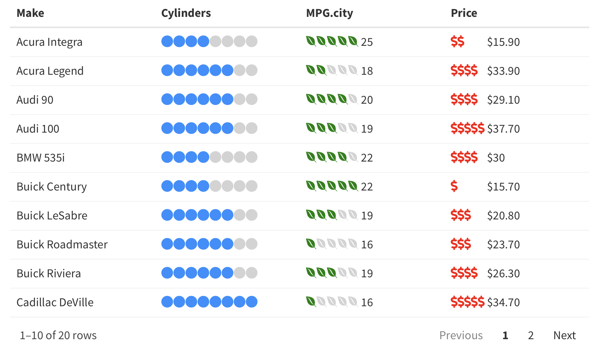

## reactablefmtr <a href='https://kcuilla.github.io/reactablefmtr/index.html'>

<!-- badges: start -->
[](https://cran.r-project.org/package=reactablefmtr?color=blue)
[](https://cranlogs.r-pkg.org/badges/last-month/reactablefmtr?color=brightgreen)
<!-- badges: end -->

The {reactablefmtr} package simplifies and enhances the styling and formatting of tables built with the {reactable} **R** package. The {reactablefmtr} package provides many conditional formatters that are highly customizable and easy to use.

* **Conditionally format tables** with [color scales](https://kcuilla.github.io/reactablefmtr/articles/color_scales.html), [color tiles](https://kcuilla.github.io/reactablefmtr/articles/color_tiles.html), and [data bars](https://kcuilla.github.io/reactablefmtr/articles/data_bars_development.html). Assign icons from [Font Awesome](https://fontawesome.com/icons?d=gallery&p=2) with [icon assign](https://kcuilla.github.io/reactablefmtr/articles/icon_assign.html) and [icon sets](https://kcuilla.github.io/reactablefmtr/articles/icon_sets.html).
* **Custom table themes** with a growing list of [themes](https://kcuilla.github.io/reactablefmtr/articles/themes.html) that can easily be applied to any {reactablefmtr} or {reactable} table.
* **Embed images** directly from the web into your [table](https://kcuilla.github.io/reactablefmtr/articles/embed_img.html).
* **Save tables** as static PNG files or as interactive HTML files.

The {reactablefmtr} package was built using a combination of **R**, **CSS**, and **HTML** in order to allow any level of **R** user to build highly customizable and stylish tables without having to learn additional programming languages.

## Installation

The {reactablefmtr} package is available from CRAN and can be installed with:

```{r}
install.packages("reactablefmtr")
```

Or install the development version of {reactablefmtr} with:

```{r}
remotes::install_github("kcuilla/reactablefmtr")
```

## Examples

## Data Bars

Use `data_bars()` to assign a horizontal bars to each row. See the [tutorial](https://kcuilla.github.io/reactablefmtr/articles/data_bars_development.html) for customization options. 


## Color Scales

Use `color_scales()` to assign conditional colors to cells based on their value. The color of the text in the cells automatically adjusts based on the shade of the cell color. See the [tutorial](https://kcuilla.github.io/reactablefmtr/articles/color_scales.html) for customization options.

```{r}
library(viridis)
reactable(
  iris,
  defaultColDef = colDef(
    style = color_scales(iris, colors = viridis::magma(5))
  )
)
```


## Color Tiles

A similar option to `color_scales()` is `color_tiles()`. Numbers can be formatted using any formatter from the {scales} package, just like how they are in {ggplot2}. 

```{r}
reactable(
  iris,
  defaultColDef = colDef(
    cell = color_tiles(iris, colors = viridis::magma(5))
  )
)
```


See the [tutorial](https://kcuilla.github.io/reactablefmtr/articles/color_tiles.html) for additional examples.

## Icon Assign

Use `icon_assign()` to replace values with any icon from the Font Awesome library. Multiple customization options are available, such as bucketing and including the values next to the icons. See [tutorial](https://kcuilla.github.io/reactablefmtr/articles/icon_assign.html) for more options.

```{r}
reactable(
  data,
  defaultColDef = colDef(align = "left", maxWidth = 200),
  columns = list(
    Cylinders = colDef(cell = icon_assign(data)),
    MPG.city = colDef(cell = icon_assign(data, icon = "envira", fill_color = "green", buckets = 5, show_values = "right")),
    Price = colDef(cell = icon_assign(data, icon = "dollar-sign", fill_color = "red", empty_color = "white", buckets = 5, show_values = "right", number_fmt = scales::dollar))
  )
)
```



## Custom Themes

In {reactablefmtr}, there are 24+ custom table themes, including bootstrap themes, news/sports site-inspired themes, and more. The themes can be applied easily to tables by simply referencing the theme name. Additional customization options, such as changing the font size, font color, etc. are also [available](https://kcuilla.github.io/reactablefmtr/articles/themes.html).

```{r}
data %>%
  reactable(.,
    theme = slate(),
    defaultColDef = colDef(
      cell = data_bars(., fill_color = viridis::mako(5), text_position = "inside-end")
  )
)
```

## Save Static or Interactive Tables

{reactablefmtr} or {reactable} tables can be saved directly to a file as a static PNG image or interactive HTML file with `save_reactable()`.

Save as a PNG file:

```{r}
save_reactable(table_name, "table.png")
```

Save as an HTML file:

```{r}
save_reactable(table_name, "table.html")
```

If custom CSS styling is applied to the table within an R Markdown document:

```{r}
save_reactable("table_name.Rmd", "table.png")
```


## Acknowledgments & Contributions

A huge thank you to Greg Lin for creating the amazing {reactable} [package]((https://glin.github.io/reactable/index.html))! Without Greg, {reactablefmtr} simply would not exist! 

Also thank you to June Chao for contributing the option to choose columns within the span option in `color_scales()` and `color_tiles()`!


