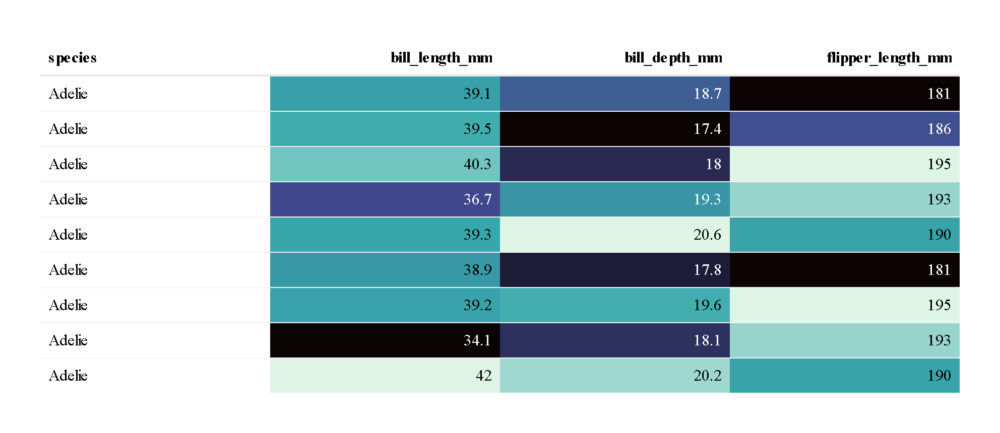
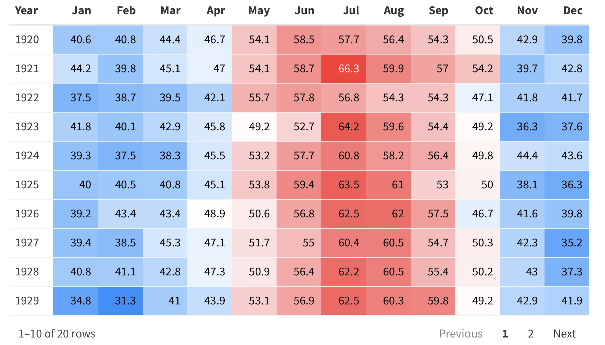
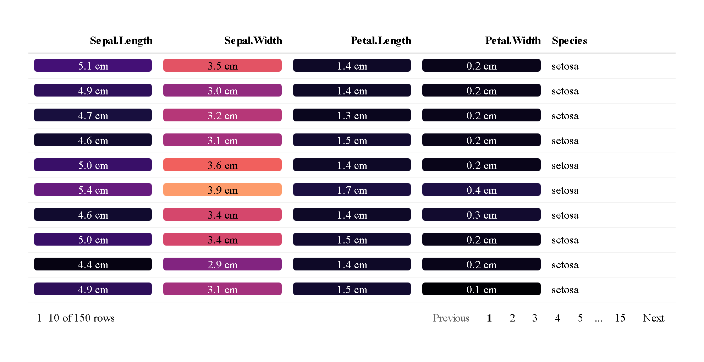
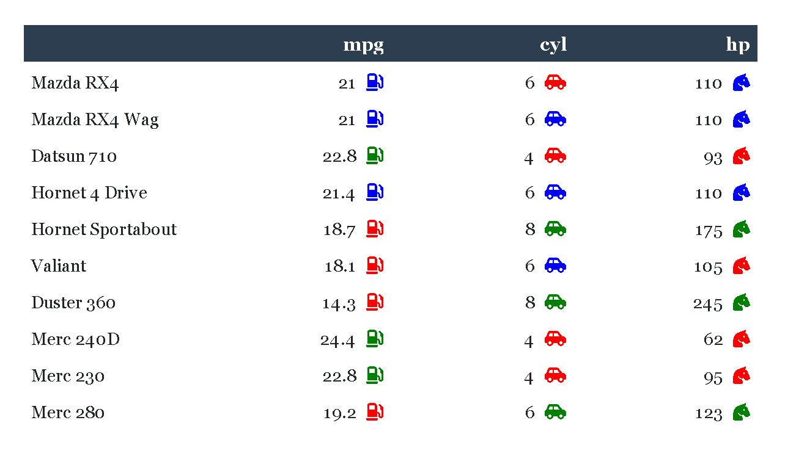
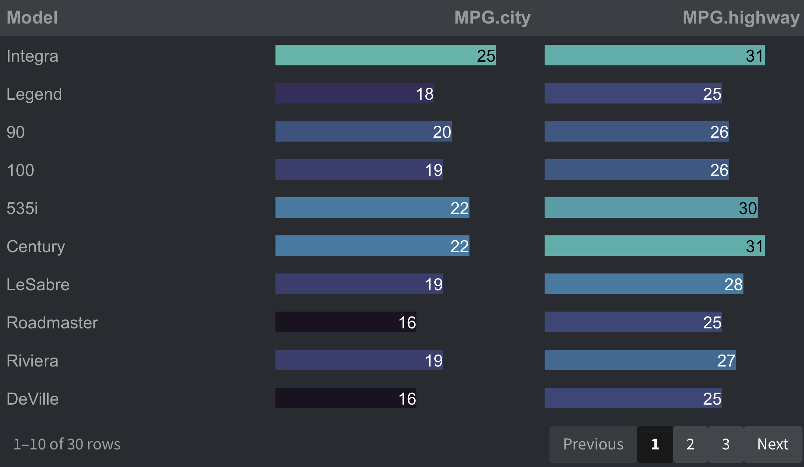
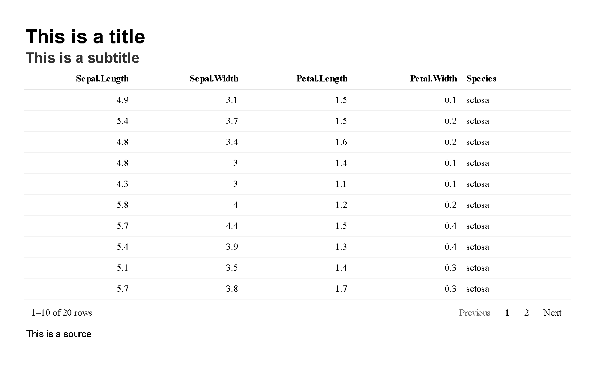

## reactablefmtr <a href='https://kcuilla.github.io/reactablefmtr/index.html'>

<!-- badges: start -->
[](https://cran.r-project.org/package=reactablefmtr?color=blue)
[](https://cranlogs.r-pkg.org/badges/grand-total/reactablefmtr?color=brightgreen)
<!-- badges: end -->

The {reactablefmtr} package simplifies and enhances the styling and formatting of tables built with the {reactable} **R** package. The {reactablefmtr} package provides many conditional formatters that are highly customizable and easy to use.

* **Conditionally format tables** with [color scales](https://kcuilla.github.io/reactablefmtr/articles/color_scales.html), [color tiles](https://kcuilla.github.io/reactablefmtr/articles/color_tiles.html), and [data bars](https://kcuilla.github.io/reactablefmtr/articles/data_bars.html). Assign icons from [Font Awesome](https://fontawesome.com/icons?d=gallery&p=2) with [icon assign](https://kcuilla.github.io/reactablefmtr/articles/icon_assign.html) and [icon sets](https://kcuilla.github.io/reactablefmtr/articles/icon_sets.html).
  
* **Custom table themes** that can [easily](https://kcuilla.github.io/reactablefmtr/articles/themes.html) be applied to any {reactablefmtr} or {reactable} table.
  
* **Embed images** directly from the web into your [table](https://kcuilla.github.io/reactablefmtr/articles/embed_img.html).
  
* **Save tables** as static PNG files or as interactive HTML files.

The {reactablefmtr} package was built using a combination of **R**, **CSS**, and **HTML** in order to allow any level of **R** user to build highly customizable and stylish tables without having to learn additional programming languages.

For more examples, check out the [vignettes](https://kcuilla.github.io/reactablefmtr/articles/). To stay up to date with the latest upgrades to the development version, be sure to follow the package [news](https://kcuilla.github.io/reactablefmtr/news/index.html).

## Installation

The {reactablefmtr} package is available from CRAN and can be installed with:

```{r}
install.packages("reactablefmtr")
```

Or install the development version of {reactablefmtr} with:

```{r}
remotes::install_github("kcuilla/reactablefmtr")
```

## Examples

### Data Bars

Use `data_bars()` to assign horizontal bars to each row. There are many ways to [customize](https://kcuilla.github.io/reactablefmtr/reference/data_bars.html) the look of `data_bars()`, including the alignment of the bars, the posiiton of the text labels, and the option to add icons and images to the bars. See the [tutorial](https://kcuilla.github.io/reactablefmtr/articles/data_bars.html) for customization examples. 


### Color Scales

Use `color_scales()` to assign conditional colors to cells based on their relative values. The color of the text in the cells automatically adjusts based on the shade of the cell color, allowing the use of both dark-colored and light-colored palettes.

```{r}
library(palmerpenguins)
library(dplyr)
library(viridis)
  
data <- palmerpenguins %>%
  select(species, bill_length_mm, bill_depth_mm, flipper_length_mm)

reactable(
  data,
  columns = list(
    bill_length_mm = colDef(style = color_scales(data, colors = viridis::mako(4))),
    bill_depth_mm = colDef(style = color_scales(data, colors = viridis::mako(4))),
    flipper_length_mm = colDef(style = color_scales(data, colors = viridis::mako(4)))
  )
)
```




By default, colors are conditionally assigned to values within each column, but can also be assigned to row-wise data as shown below. See the [tutorial](https://kcuilla.github.io/reactablefmtr/articles/color_scales.html) for more examples.

```{r}
dimnames <- list(start(nottem)[1]:end(nottem)[1], month.abb)
temps <- matrix(nottem, ncol = 12, byrow = TRUE, dimnames = dimnames)
temps <- as_tibble(temps, rownames = "Year")

reactable(
  temps,
  defaultColDef = colDef(
    style = color_scales(temps, span = TRUE, colors = c("#1e90ff", "#ffffff", "#ff3030")),
    minWidth = 50
  )
)
```



  
### Color Tiles

A similar formatter to `color_scales()` is `color_tiles()`. Numbers can be formatted using any formatter from the {scales} package, just like how they are in {ggplot2}. See the [tutorial](https://kcuilla.github.io/reactablefmtr/articles/color_tiles.html) for customization options.

```{r}
reactable(
  iris,
  defaultColDef = colDef(
    cell = color_tiles(iris, colors = viridis::magma(10), number_fmt = scales::number_format(accuracy = 0.1, suffix = " cm"))
  )
)
```



### Icon Sets

Use `icon_sets()` to conditionally assign icons to values from the [Font Awesome](https://fontawesome.com/icons?d=gallery&p=2) library based on their relative values. Any number of icons and/or colors can be applied to values within each column. Customization options such as number formatting and positioning of icons are also available. See the [tutorial](https://kcuilla.github.io/reactablefmtr/articles/icon_sets.html) for more options.

```{r}
mtcars[1:10,c(1,2,4)] %>% 
reactable(., 
          theme = flatly(),
          defaultColDef = colDef(maxWidth = 150),
          columns = list(
            mpg = colDef(cell = icon_sets(., icons = "gas-pump", colors = c("red","blue","green"))),
            cyl = colDef(cell = icon_sets(., icons = "car-side", colors = c("red","blue","green"))),
            hp = colDef(cell = icon_sets(., icons = "horse-head", colors = c("red","blue","green")))
          )
)
```


  
 
### Icon Assign

Use `icon_assign()` to assign icons to values from the [Font Awesome](https://fontawesome.com/icons?d=gallery&p=2) library. Multiple customization options are available, such as bucketing values and the option to show/hide values next to the icons. See the [tutorial](https://kcuilla.github.io/reactablefmtr/articles/icon_assign.html) for more options.

```{r}
data <- MASS::Cars93[1:20, c("Make", "Cylinders", "MPG.city", "Price")]

reactable(
  data,
  defaultColDef = colDef(align = "left", maxWidth = 200),
  columns = list(
    Cylinders = colDef(cell = icon_assign(data)),
    MPG.city = colDef(cell = icon_assign(data, icon = "envira", fill_color = "green", buckets = 5, show_values = "right")),
    Price = colDef(cell = icon_assign(data, icon = "dollar-sign", fill_color = "red", empty_color = "white", buckets = 5, show_values = "right", number_fmt = scales::dollar))
  )
)
```


## Custom Themes

Within {reactablefmtr}, there are 24+ custom table themes. The themes include [bootstrap](https://bootswatch.com/) themes, themes inspired by news/sports sites such as The New York Times, FiveThirtyEight, and ESPN, as well as other custom themes that can only be found within {reactablefmtr}. The themes can be applied easily to tables by simply referencing the theme name. Additional customization options, such as changing the font size, font color, etc. are also [available](https://kcuilla.github.io/reactablefmtr/articles/themes.html).

```{r}
data <- MASS::Cars93[1:20, c("Model", "MPG.city", "MPG.highway")]
        
data %>%
  reactable(.,
    theme = slate(),
    defaultColDef = colDef(
      cell = data_bars(., fill_color = viridis::mako(5), text_position = "inside-end")
  )
)
```




## Add a Title, Subtitle, and Source

Titles and subtitles can be easily placed above any {reactablefmtr} or {reactable} table with `add_title()` and `add_subtitle()`. Also have the option to include a source below a table with `add_source()`. Additional customization options such as changing the alignment, font size, font family, font style, and font color are available within each formatter.

```{r}
reactable(iris[10:29, ]) %>%
  add_title("This is a title") %>% 
  add_subtitle("This is a subtitle") %>% 
  add_source("This is a source")
```




## Save Static or Interactive Tables

{reactablefmtr} or {reactable} tables can be saved directly to a file as a static PNG image or as an interactive HTML file with `save_reactable()`.

Save as a PNG file:

```{r}
save_reactable(table_name, "table.png")
```

Save as an HTML file:

```{r}
save_reactable(table_name, "table.html")
```

If custom CSS styling is applied to the table within an R Markdown document:

```{r}
save_reactable("table_name.Rmd", "table.png")
```

If you prefer to use a pipe:

```{r}
table_name %>%
save_reactable("table.png")
```


## Acknowledgments & Contributions

A huge thank you to Greg Lin for creating the amazing {reactable} [package]((https://glin.github.io/reactable/index.html))! Without Greg, {reactablefmtr} simply would not exist! 

Also thank you to June Chao for contributing to the span option in `color_scales()` and `color_tiles()`!


