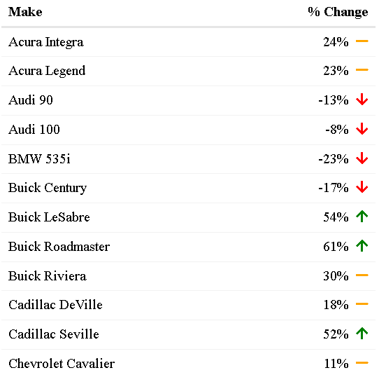

# reactablefmtr 

<!-- badges: start -->
<!-- badges: end -->

Simplify the styling, formatting, and customization of tables made with `{reactable}`.


## Installation

You can install the `{reactablefmtr}` package from GitHub with:

```{r}
remotes::install_github("kcuilla/reactablefmtr")
library(reactablefmtr)
```

## Background

`{reactablefmtr}` is an extension of the `{reactable}` package created by Greg Lin. Before you use `{reactablefmtr}`, you need to first have an understanding of how to use `{reactable}`. Greg Lin put together a great overview [here](https://glin.github.io/reactable/index.html) that I recommend checking out. It has many examples and tutorials that are necessary to learn `{reactable}`.

A challenge of creating tables with `{reactable}` is that some of the code required to style and format the tables is a bit lengthy and can be difficult to understand for someone who is a novice R user. The `{reactablefmtr}` aims to firstly simplify the customization and formatting process that can be used by any R user regardless of their experience, and secondly, reduce the amount of time and effort required to build a table with {reactable}. 

## Acknowledgements

A huge thank you to Greg Lin for creating the amazing {reactable} package! Without him, {reactablefmtr} simply would not exist.

## Showcase

### color_scales()

By default, `color_scales()` assigns a three-color red-white-blue pattern based on the value of the cells in a column from low to high:

```{r}
data <- iris[10:29, ]

reactable(data,
          columns = list(Petal.Length = colDef(style = color_scales(data))))
```


You can change the color scheme to any number of colors you'd like by specifying the colors in a vector and `color_scales()` will assign the colors from low to high in the order you provide:

```{r}
reactable(data,
          columns = list(
          Petal.Length = colDef(style = color_scales(data, c("purple", "pink", "white", "green")))))
```


You can also apply `color_scales()` across all columns and use custom color palettes such as the "Spectral" color set from {RColorBrewer}:

```{r}
reactable(data,
          defaultColDef = colDef(style = color_scales(data, brewer.pal(3, "Pastel1"))))
```


### data_bars()

By default, `data_bars()` assigns a horizontal bar to each row relative to it's value compared to other values in a particular column:

```{r}
data <- MASS::Cars93[20:49, c("Make", "MPG.city", "MPG.highway")]

reactable(data,
          columns = list(
          MPG.city = colDef(align = "left", # align column header
                            cell = data_bars(data))))
```


You can change both the color of the data bars and the background:

```{r}
reactable(data,
          columns = list(
          MPG.city = colDef(align = "left", # align column header
                            cell = data_bars(data, "forestgreen", "lightgrey"))))
```


Just like with `color_scales()`, you can apply a gradient of colors to your data bars if you assign more than one color in a vector:

```{r}
data <- MASS::Cars93[1:15, c("Make", "MPG.city", "MPG.highway")]

reactable(data,
  pagination = FALSE, # display all rows on one page
  defaultSortOrder = "desc", # sort by descending order
  defaultSorted = "MPG.city", # sort by MPG.city
  defaultColDef = colDef(cell = data_bars(data, c("firebrick1", "gold", "limegreen")
  ))
)
```


### data_bars_pos_neg()

If your column contains negative values but you would like to show data bars for the values, you can use `data_bars_pos_neg()`:

```{r}
data <- data %>% 
  mutate(Change = round(runif(15, min = -7, max = 5))) %>% 
  select(Make, Change)

reactable(data, 
          pagination = FALSE,
          columns = list(
          Change = colDef(align = "center", # align column header
                          cell = data_bars_pos_neg(data))))
```


If your column is displaying percentages rather than whole numbers, you can add the percent symbol by setting `percent = TRUE`:

```{r}
data <- data %>% 
  mutate('% Change' = round(runif(15, min = -0.7, max = 0.7), digits = 2)) %>% 
  select(Make, '% Change')

reactable(data, 
          pagination = FALSE,
          columns = list(
          `% Change` = colDef(align = "center", # align column header
                              cell = data_bars_pos_neg(data, percent = TRUE))))
```


You may also apply a color gradient to the data bars by assigning three or more colors:

```{r}
reactable(data, 
          pagination = FALSE,
          columns = list(
          `% Change` = colDef(align = "center",
                              cell = data_bars_pos_neg(data, colors = c("#ff3030", "#ffffff", "#1e90ff"), percent = TRUE))))

```


### icon_sets()

By default, `icon_sets()` adds a circle icon from [Font Awesome](https://fontawesome.com/icons?d=gallery) to each value and assigns a color from red-orange-green depending on the value in relation to other values within a particular column:

```{r}
data <- MASS::Cars93[1:10, c("Make", "MPG.city", "MPG.highway")]

reactable(data, 
          defaultColDef = colDef(cell = icon_sets(data)))
```


You can use any icon you'd like from the Font Awesome library by assigning the icons from low to high, as well as the color scheme:

```{r}
reactable(data, 
          defaultColDef = colDef(cell = icon_sets(data, 
                                                  icons = c("times-circle","minus-circle","check-circle"), 
                                                  colors = c("#ff3030", "#d3d3d3", "#1e90ff"))))
```


If you're working with percentages, you can add the percent symbol by setting `percent = TRUE`:

```{r}
data <- data %>% 
  mutate('% Change' = round(runif(12, min = -0.7, max = 0.7), digits = 2)) %>% 
  select(Make, '% Change')

reactable(data, 
          pagination = FALSE, # display all rows on one page
          defaultColDef = colDef(cell = icon_sets(data, 
                                                  icons = c("arrow-down","minus","arrow-up"), percent = TRUE)))
```



### highlight_min(), highlight_max(), highlight_min_max()

Find the maximum value in each column (default color is green but can change to any color using the `font_color` option):

```{r}
data <- MASS::Cars93[17:25, c("Make", "Price", "EngineSize", "MPG.city", "MPG.highway")]  

reactable(data, 
          defaultColDef = colDef(style = highlight_max(data)))
```


Find the minimum value in each column:

```{r}
data <- MASS::Cars93[17:25, c("Make", "Price", "EngineSize", "MPG.city", "MPG.highway")]  

reactable(data, 
          defaultColDef = colDef(style = highlight_min(data)))
```


If you would like to highlight both the minimum and maximum values in each column you can use `highlight_min_max()`

```{r}
data <- MASS::Cars93[17:25, c("Make", "Price", "EngineSize", "MPG.city", "MPG.highway")]  

reactable(data, 
          defaultColDef = colDef(style = highlight_min_max(data)))
```


You can optionally highlight the background of the cell as well with the `min_highlighter` and `max_highlighter` options:

```{r}
data <- MASS::Cars93[17:25, c("Make", "Price", "EngineSize", "MPG.city", "MPG.highway")]  

reactable(data, 
          defaultColDef = colDef(style = highlight_min_max(data, 
                                                           min_font_color = "white", 
                                                           min_highlighter = "#ff3030",
                                                           max_font_color = "white", 
                                                           max_highlighter = "#1e90ff")))
```

