# reactablefmtr 

<!-- badges: start -->
[](https://cran.r-project.org/package=reactablefmtr)
<!-- badges: end -->

Simplify the styling, formatting, and customization of tables made with `{reactable}`.

- [Color Scales](https://kcuilla.github.io/reactablefmtr/articles/color_scales.html)
- [Color Tiles](https://kcuilla.github.io/reactablefmtr/articles/color_tiles.html)
- [Data Bars](https://kcuilla.github.io/reactablefmtr/articles/data_bars.html)
- [Embed Images](https://kcuilla.github.io/reactablefmtr/articles/embed_img.html)
- [Highlight Min & Max](https://kcuilla.github.io/reactablefmtr/articles/highlight_min_max.html)
- [Icon Assign](https://kcuilla.github.io/reactablefmtr/articles/icon_assign.html)
- [Icon Sets](https://kcuilla.github.io/reactablefmtr/articles/icon_sets.html)


## Installation

The `{reactablefmtr}` package is available from CRAN:

```{r}
install.packages("reactablefmtr")
```

Or you can install the development version from GitHub with:

```{r}
remotes::install_github("kcuilla/reactablefmtr")
```

## Background

`{reactablefmtr}` is an extension of the `{reactable}` package created by Greg Lin. Before you use `{reactablefmtr}`, you need to first have an understanding of how to use `{reactable}`. Greg Lin put together a great overview [here](https://glin.github.io/reactable/index.html) that I recommend checking out. It has many examples and tutorials that are necessary to learn `{reactable}`.

A challenge of creating tables with `{reactable}` is that some of the code required to style and format the tables is a bit lengthy and can be difficult to understand for someone who is a novice R user. The `{reactablefmtr}` aims to firstly simplify the customization and formatting process that can be used by any R user regardless of their experience, and secondly, reduce the amount of time and effort required to build a table with {reactable}. 

### Acknowledgments

A huge thank you to Greg Lin for creating the amazing {reactable} package! Without Greg, {reactablefmtr} simply would not exist.


## Showcase

### Animated Data Bars - development version only

Data bars are now animated! Please note that this feature is only available in the development version only and is not on CRAN at the moment. To download the development version of {reactablefmtr} please see the installation section above.

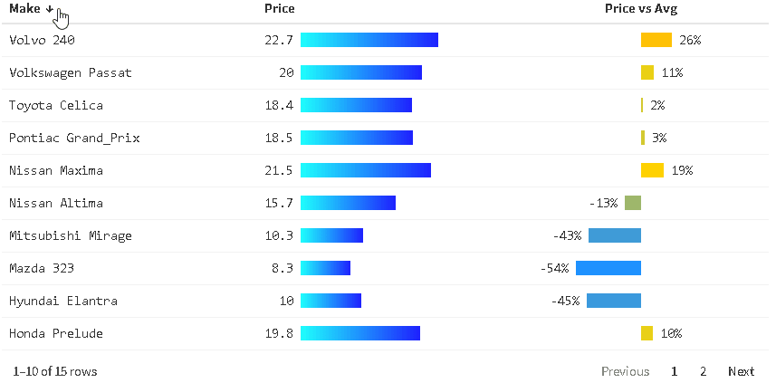

You may also notice that gradient colors can be applied to data bars as well, which is covered in the `data_bars_gradient()` section below.  

### color_scales()

By default, `color_scales()` assigns a three-color red-white-blue pattern based on the value of the cells in a column from low to high:

```{r}
data <- iris[10:29, ]

reactable(data,
          columns = list(Petal.Length = colDef(style = color_scales(data))))
```


You can change the color scheme to any number of colors you'd like by specifying the colors in a vector and `color_scales()` will assign the colors from low to high in the order you provide:

```{r}
reactable(data,
          columns = list(
          Petal.Length = colDef(style = color_scales(data, 
                                                     colors = c("purple", "pink", "white", "green")))))
```
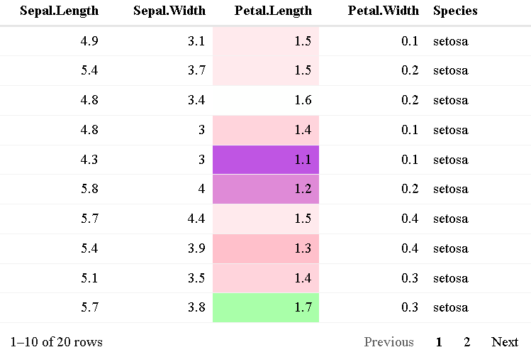

You can also apply `color_scales()` across all columns and use custom color palettes such as the "Spectral" color set from {RColorBrewer}:

```{r}
reactable(data,
          defaultColDef = colDef(style = color_scales(data, 
                                                      colors = brewer.pal(3, "Pastel1"))))
```
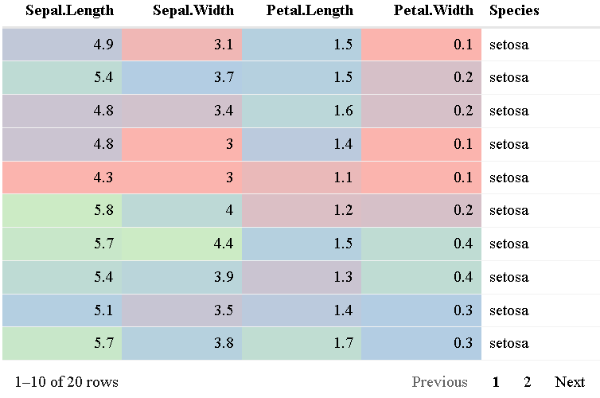

Previously in {reactable}, using dark color palettes such as the "magma" color set from {viridis} was troublesome since you couldn't see the values in the cells with dark backgrounds. Now, with {reactablefmtr}, the colors of the values automatically are changed to white if the colors are dark:

```{r}
library(viridis)
reactable(data,
          defaultColDef = colDef(style = color_scales(data,
                                                      colors = viridis::magma(5))))
```

<i>Note: this feature is only available in the development version and is not on CRAN at the moment.</i>

### color_tiles() - development version only

Another option of conditionally coloring cells based on their values is with `color_tiles()`: 
<i>Note: this feature is only available in the development version and is not on CRAN at the moment.</i>

```{r}
data <- iris[10:29, ]

reactable(data,
          defaultColDef = colDef(cell = color_tiles(data)))
```


Note that `color_tiles()` needs to be placed within the `cell` argument, whereas `color_scales()` is placed within `style`. A benefit of using `color_tiles()` over `color_scales()` is that you have the option to format the values using formatters from the [scales](https://www.tidyverse.org/blog/2018/08/scales-1-0-0/) package similar to how you would in ggplot2: 

```{r}
car_prices <- MASS::Cars93[20:49, c("Make", "Price", "Weight")]

reactable(car_prices,
          columns = list(
            Price = colDef(align = "center",
                           cell = color_tiles(car_prices,
                                              number_fmt = scales::dollar)),
            Weight = colDef(align = "center",
                            cell = color_tiles(car_prices,
                                               number_fmt = scales::comma))))
```


Just like with `color_scales()`, you are now free to use dark color palettes:

```{r}
library(viridis)
reactable(data,
          defaultColDef = colDef(style = color_tiles(data,
                                                     colors = viridis::magma(5))))
```

<i>Note: this feature is only available in the development version and is not on CRAN at the moment.</i>

### data_bars()

By default, `data_bars()` assigns a horizontal bar to each row relative to it's value compared to other values in a particular column:

```{r}
data <- MASS::Cars93[20:49, c("Make", "MPG.city", "MPG.highway")]

reactable(data,
          columns = list(
          MPG.city = colDef(align = "left", # align column header
                            cell = data_bars(data)),
          MPG.highway = colDef(align = "left", # align column header
                               cell = data_bars(data))))
```


You can change both the color of the data bars and the background:

```{r}
reactable(data,
          columns = list(
          MPG.city = colDef(align = "left", # align column header
                            cell = data_bars(data, "forestgreen", "lightgrey")),
          MPG.highway = colDef(align = "left", # align column header
                               cell = data_bars(data, "forestgreen", "lightgrey"))))
```
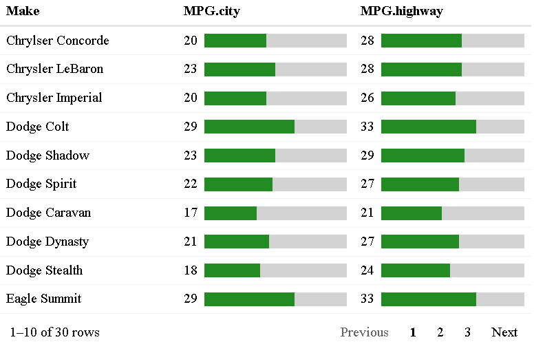

Just like with `color_scales()`, you can apply a gradient of colors to your data bars if you assign more than one color in a vector:

```{r}
data <- MASS::Cars93[1:15, c("Make", "MPG.city", "MPG.highway")]

reactable(data,
  pagination = FALSE, # display all rows on one page
  defaultSortOrder = "desc", # sort by descending order
  defaultSorted = "MPG.city", # sort by MPG.city
  defaultColDef = colDef(cell = data_bars(data, c("firebrick1", "gold", "limegreen")
  ))
)
```
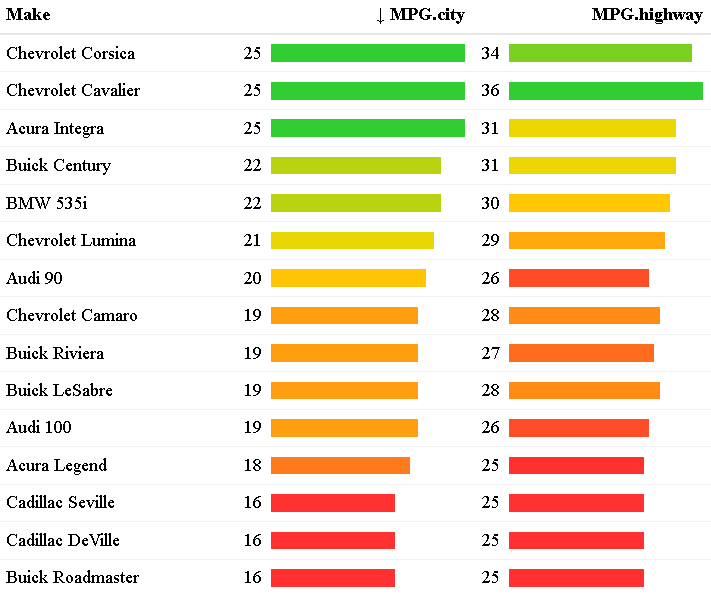

You can also now format numbers with the scales package the same way that you would format numbers in the `color_tiles()` example above. The `number_fmt` option is available for `data_bars_gradient()` and `data_bars_pos_neg()` as well.

```{r}
car_prices <- MASS::Cars93[20:49, c("Make", "Price", "Weight")]

reactable(car_prices,
          columns = list(
            Price = colDef(align = "center",
                           cell = data_bars(car_prices,
                                            number_fmt = scales::dollar_format(accuracy = 1))),
            Weight = colDef(align = "center",
                            cell = data_bars(car_prices,
                                             number_fmt = scales::comma))))
```


<i>Note: the `number_fmt` option is currently only available in the development version.</i>

### data_bars_gradient() - development version only

<i>Please note: this function is currently only available in the development version and not on CRAN as of this moment.</i>

If you would like to customize your `data_bars()` a step further and apply a linear color gradient, you can now use `data_bars_gradient()`:

```{r}
data <- sample_n(penguins,50) %>% # sample 50 rows
  filter(!is.na(bill_length_mm)) %>% # remove NA's
  select(species, island, body_mass_g)

reactable(data,
          columns = list(
            body_mass_g = colDef(cell = data_bars_gradient(data))))
```
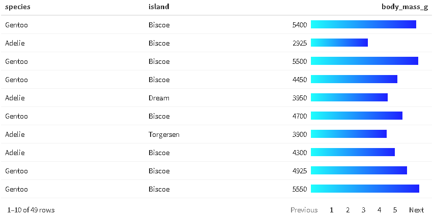

You can add as many colors as you would like to make the gradient:

```{r}
reactable(data,
          columns = list(
            body_mass_g = colDef(cell = data_bars_gradient(data, colors = c("red", "orange", "yellow", "green", "blue", "indigo", "violet"))))
```
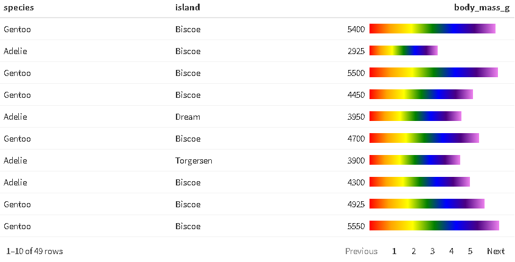


### data_bars_pos_neg()

If your column contains negative values but you would like to show data bars for the values, you can use `data_bars_pos_neg()`:

```{r}
data <- data %>% 
  mutate(Change = round(runif(15, min = -7, max = 5))) %>% 
  select(Make, Change)

reactable(data, 
          pagination = FALSE,
          columns = list(
          Change = colDef(align = "center", # align column header
                          cell = data_bars_pos_neg(data))))
```
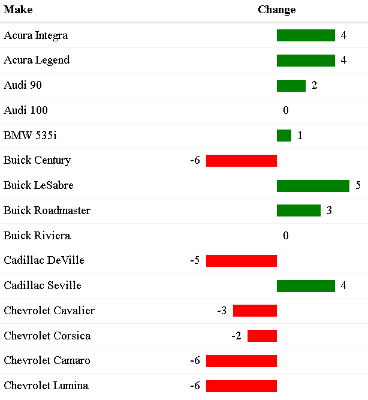

If your column is displaying percentages rather than whole numbers, you can add the percent symbol by using the percent formatter from the scales package within `number_fmt`:

```{r}
data <- data %>% 
  mutate('% Change' = round(runif(15, min = -0.7, max = 0.7), digits = 2)) %>% 
  select(Make, '% Change')

reactable(data, 
          pagination = FALSE,
          columns = list(
          `% Change` = colDef(align = "center", # align column header
                              cell = data_bars_pos_neg(data,
                                                       number_fmt = scales::percent))))
```


You may also apply a color gradient to the data bars by assigning three or more colors:

```{r}
reactable(data, 
          pagination = FALSE,
          columns = list(
          `% Change` = colDef(align = "center",
                              cell = data_bars_pos_neg(data, 
                                                       colors = c("#ff3030", "#ffffff", "#1e90ff"), 
                                                       number_fmt = scales::percent))))

```
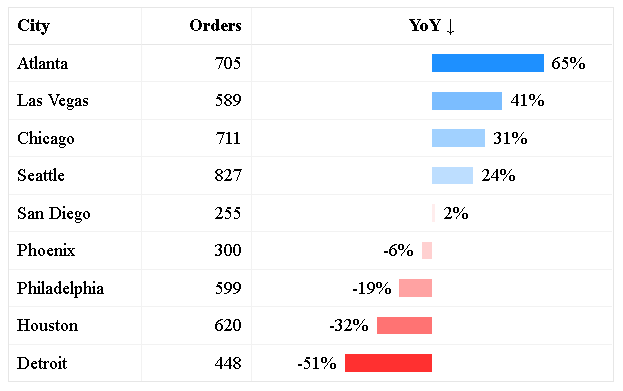


### icon_sets()

By default, `icon_sets()` adds a circle icon from [Font Awesome](https://fontawesome.com/icons?d=gallery) to each value and assigns a color from red-orange-green depending on the value in relation to other values within a particular column:

```{r}
data <- MASS::Cars93[1:10, c("Make", "MPG.city", "MPG.highway")]

reactable(data, 
          defaultColDef = colDef(cell = icon_sets(data)))
```
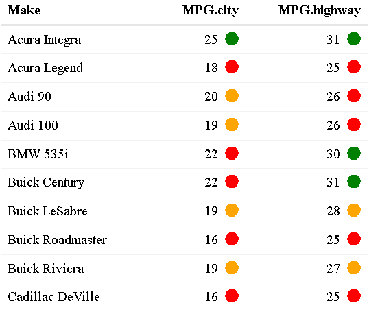

You can use any icon you'd like from the Font Awesome library by assigning the icons from low to high, as well as the color scheme:

```{r}
reactable(data, 
          defaultColDef = colDef(cell = icon_sets(data, 
                                                  icons = c("times-circle","minus-circle","check-circle"), 
                                                  colors = c("#ff3030", "#d3d3d3", "#1e90ff"))))
```


Format numbers using formatters from the scales package with `number_fmt`:

```{r}
car_prices <- MASS::Cars93[20:49, c("Make", "Price", "Weight")]

reactable(car_prices,
          columns = list(
            Price = colDef(align = "center",
                           cell = icon_sets(car_prices,
                                            number_fmt = scales::dollar_format(accuracy = 1))),
            Weight = colDef(align = "center",
                            cell = icon_sets(car_prices,
                                             number_fmt = scales::comma))))
```


<i>Note: the `number_fmt` option is currently only available in the development version.</i>


### highlight_min(), highlight_max(), highlight_min_max()

Find the maximum value in each column (default color is green but can change to any color using the `font_color` option):

```{r}
data <- MASS::Cars93[17:25, c("Make", "Price", "EngineSize", "MPG.city", "MPG.highway")]  

reactable(data, 
          defaultColDef = colDef(style = highlight_max(data)))
```
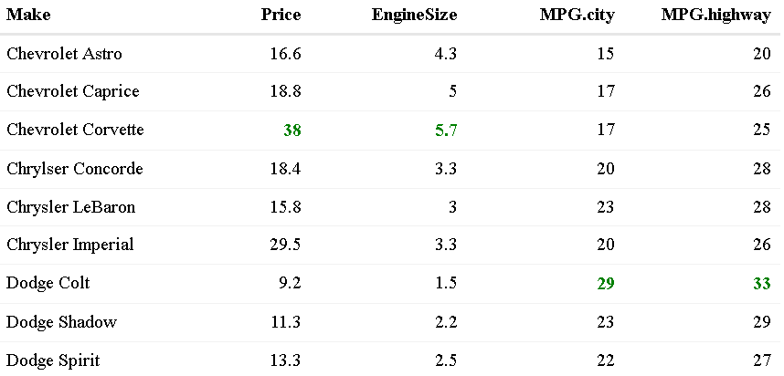

Find the minimum value in each column:

```{r}
data <- MASS::Cars93[17:25, c("Make", "Price", "EngineSize", "MPG.city", "MPG.highway")]  

reactable(data, 
          defaultColDef = colDef(style = highlight_min(data)))
```


If you would like to highlight both the minimum and maximum values in each column you can use `highlight_min_max()`

```{r}
data <- MASS::Cars93[17:25, c("Make", "Price", "EngineSize", "MPG.city", "MPG.highway")]  

reactable(data, 
          defaultColDef = colDef(style = highlight_min_max(data)))
```


You can optionally highlight the background of the cell as well with the `min_highlighter` and `max_highlighter` options:

```{r}
data <- MASS::Cars93[17:25, c("Make", "Price", "EngineSize", "MPG.city", "MPG.highway")]  

reactable(data, 
          defaultColDef = colDef(style = highlight_min_max(data, 
                                                           min_font_color = "white", 
                                                           min_highlighter = "#ff3030",
                                                           max_font_color = "white", 
                                                           max_highlighter = "#1e90ff")))
```
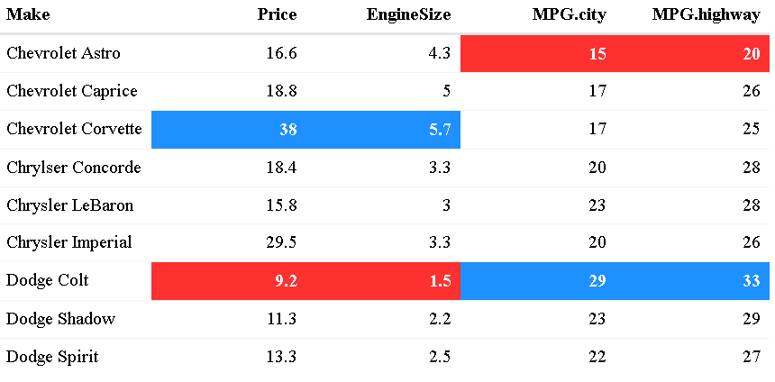
